# 🚀 Post tracking system

> Project consists of vanilla PHP api backend and React.js frontend
>
> ⚠️ **PHP API** is responsible for all core logic, where key principles, design patterns, and techniques have been applied.  
> **React** is used only for the displaying and interacting with data, following a component-based principles.  
>  
> Feel free to refactor either part as needed. Good luck!


---

## 📚 Table of Contents

- [🧩 Functionality](#-functionality)
- [💻 How to Run](#-how-to-run)
- [⚙️ How Does It Work](#-how-does-it-work)
- [📐 Programming Principles](#-programming-principles)
- [🏗️ Design Patterns](#-design-patterns)
- [🔧 Refactoring Techniques](#-refactoring-techniques)
- [📄 Line of code](#-line-of-code)
- [🎥 Demonstration](#-demonstration)

---

## 🧩 Functionality

The core idea of this project revolves around a **shipment management system with tracking** used by both **regular users** and **administrators**.

- 🔹 **Users** can interact with their shipments (both sent and received), manage their profile, and create support tickets in case of issues.
- 🔹 **Admins** oversee all aspects of the system: managing users, shipments, post offices, and user support tickets.

---

### 📄 Pages Overview

#### 🌐 Generic

- **Login** – Authenticate using email and password.
- **Registration** – Register a new account with email and password.

#### 👤 Regular User

- **Profile** – View and update personal information.
- **Shipments** – View all shipments sent by the user and create new shipments.
- **Receiving** – Track shipments received from other users.
- **Tracking** – Monitor the status, current location, departure and destination, and dates for all user-related shipments.
- **Support** – Submit support tickets for any issues and review the status of existing tickets (open or closed).

#### 🛠️ Administrator

- **Profile** – Same as regular user, with the ability to update personal information.
- **Tracking** – Access and manage all users’ shipments, with controls to cancel or update shipment status and details.
- **Users** – View all registered users and remove accounts if necessary.
- **Post Offices** – Manage post office records, including creating new entries or updating existing ones.
- **Support Tickets** – Oversee all support requests, including replying, closing, or reopening tickets as needed.

All the data is saved in mysql database managed by phpMyAdmin

---

## 💻 How to Run

Follow the steps below to get the project running locally using Docker.

---

### 📦 Prerequisites

- ✅ Make sure **Docker** and **Docker Compose** are installed on your machine.  
  👉 [Docker Installation Guide (macOS, Windows, Linux)](https://github.com/WCSCourses/index/blob/main/Docker_guide.md#docker-installation-guide-for-macos-windows-and-linux)

---

### 📂 Clone the Repository

```bash
git clone https://github.com/merelythesame/post-tracking-system.git
cd post-tracking-system
```

---

### 🚀 Start the Project with Docker

In the root of the project directory, run:

```bash
docker compose up -d --build
```

> ⚠️ _It may take a few minutes to download and build all the required images. Please be patient._

---

### 📋 Verify Running Containers

Check if all containers are up and running:

```bash
docker compose ps
```

You should see **four containers** with status `Up`:
- `php-backend`
- `react-frontend`
- `mysql-db`
- `pma` (phpMyAdmin)

---

### 🛠️ Database Setup (Important)

Access phpMyAdmin at:  
👉 [http://localhost:8080](http://localhost:8080)

The project is configured to **auto-import** the database on launch. If for some reason the tables are missing:

1. Navigate to your database in **phpMyAdmin**. Database user is **root** and password is **root**
2. Click the **"Import"** tab in the top menu.
3. Select the file: `./db/project.sql`
4. Click **"Import"** to load the database schema and data.

You should now see all required tables.

---

### 🌐 Access the App

- 🔗 **Frontend (React UI)**: [http://localhost:5137](http://localhost:5137)
- 🔗 **phpMyAdmin (DB UI)**: [http://localhost:8080](http://localhost:8080)
- 🔗 **Backend (PHP API)**: [http://localhost:8000](http://localhost:8000)

> 🧪 You can test API routes using Postman or any HTTP client. **Here is documentation [https://documenter.getpostman.com/view/41681143/2sB2qgdxhQ](https://documenter.getpostman.com/view/41681143/2sB2qgdxhQ)**

---

🎉 That’s it! Your application should now be fully operational.

---

## ⚙️ How does it work

When a request is made to PHP api, it goes to the [index.php](https://github.com/merelythesame/post-tracking-system/blob/dev/backend/index.php) file which first initializes session handling and sets CORS headers to allow communication from a frontend.

Then, it includes the autoloader and instantiates [controllers](https://github.com/merelythesame/post-tracking-system/blob/dev/backend/index.php#L29-L33) for [users](https://github.com/merelythesame/post-tracking-system/blob/dev/backend/controllers/UserController.php), [shipments](https://github.com/merelythesame/post-tracking-system/blob/dev/backend/controllers/ShipmentController.php), [tracking statuses](https://github.com/merelythesame/post-tracking-system/blob/dev/backend/controllers/TrackingStatusController.php), [post offices](https://github.com/merelythesame/post-tracking-system/blob/dev/backend/controllers/PostOfficeController.php), and [support tickets](https://github.com/merelythesame/post-tracking-system/blob/dev/backend/controllers/SupportTicketController.php).

Each controller is associated with various route strategies ([GET](https://github.com/merelythesame/post-tracking-system/blob/dev/backend/routes/RouterStrategies/GetStrategy.php), [POST](https://github.com/merelythesame/post-tracking-system/blob/dev/backend/routes/RouterStrategies/AddStrategy.php), [PATCH](https://github.com/merelythesame/post-tracking-system/blob/dev/backend/routes/RouterStrategies/UpdateStrategy.php), [DELETE](https://github.com/merelythesame/post-tracking-system/blob/dev/backend/routes/RouterStrategies/DeleteStrategy.php)) that define the CRUD behavior. 

These strategies are optionally wrapped in [security decorators](https://github.com/merelythesame/post-tracking-system/tree/dev/backend/security) that enforce authorization checks (e.g., whether the user is authenticated, admin, or resource owner). 

All routes are registered to a custom [Router class](https://github.com/merelythesame/post-tracking-system/blob/dev/backend/routes/Router.php), which matches the request URI and method to the appropriate strategy using regex patterns. Once matched, the router returns the strategy and any URI parameters.

A [Dispatcher](https://github.com/merelythesame/post-tracking-system/blob/dev/backend/middleware/Dispatcher.php) then [wraps the request](https://github.com/merelythesame/post-tracking-system/blob/dev/backend/index.php#L102-L121) through middleware—specifically a [BufferingMiddleware](https://github.com/merelythesame/post-tracking-system/blob/dev/backend/middleware/BufferingMiddleware.php) that manages output buffering and sets caching headers based on the response code—before invoking the strategy. 

If no route matches, a 404 response is returned. Strategies like [GetStrategy](https://github.com/merelythesame/post-tracking-system/blob/dev/backend/routes/RouterStrategies/GetStrategy.php) then delegate the request to for example UserController methods like [getEntityById](https://github.com/merelythesame/post-tracking-system/blob/dev/backend/controllers/UserController.php#L28-L39) or [getEntityByEmail](https://github.com/merelythesame/post-tracking-system/blob/dev/backend/controllers/UserController.php#L41-L52), which in turn interact with a [UserRepository class](https://github.com/merelythesame/post-tracking-system/blob/dev/backend/repository/UserRepository.php) that runs raw SQL queries via PDO against a database. 

The repository hydrates or persists user data using the [User model](https://github.com/merelythesame/post-tracking-system/blob/dev/backend/models/User.php), which implements JsonSerializable to standardize JSON responses. 

The security layer uses decorators to check session-based roles and permissions using a [Security class](https://github.com/merelythesame/post-tracking-system/blob/dev/backend/config/Security.php). The entire request-response cycle thus flows from HTTP input to controller logic, through repository/database interaction, and finally returns a JSON-encoded HTTP response.

---

## 📐 Programming Principles

| Principle                             | Implementation                                                                                                                                                                                                                                                                                                                                                                                                                                                                                                                                                                                                                                                                                                                                                                                                                                             |
|---------------------------------------|------------------------------------------------------------------------------------------------------------------------------------------------------------------------------------------------------------------------------------------------------------------------------------------------------------------------------------------------------------------------------------------------------------------------------------------------------------------------------------------------------------------------------------------------------------------------------------------------------------------------------------------------------------------------------------------------------------------------------------------------------------------------------------------------------------------------------------------------------------|
| Single Responsibility Principle (SRP) | Controllers (e.g., [UserController](https://github.com/merelythesame/post-tracking-system/blob/dev/backend/controllers/UserController.php)) handle request logic related to users.<br>Repositories (e.g., [UserRepository](https://github.com/merelythesame/post-tracking-system/blob/dev/backend/repository/UserRepository.php)) manage DB operations only.<br>Models (e.g., [User](https://github.com/merelythesame/post-tracking-system/blob/dev/backend/models/User.php)) focus on structure and serialization.<br>Middleware (e.g., [BufferingMiddleware](https://github.com/merelythesame/post-tracking-system/blob/dev/backend/middleware/BufferingMiddleware.php)) handles buffering and cache headers.<br>[Security Decorators](https://github.com/merelythesame/post-tracking-system/tree/dev/backend/security) manage authorization separately. |
| Open/Closed Principle (OCP)           | The use of strategy patterns ([GetStrategy](https://github.com/merelythesame/post-tracking-system/blob/dev/backend/routes/RouterStrategies/GetStrategy.php), [AddStrategy](https://github.com/merelythesame/post-tracking-system/blob/dev/backend/routes/RouterStrategies/AddStrategy.php), etc.) allows new behaviors (e.g., new request types or logic) to be added without modifying existing logic.<br> Security decorators can wrap strategies without altering their internal implementation, extending behavior transparently.                                                                                                                                                                                                                                                                                                                      |
| Liskov Substitution Principle (LSP)   | Each strategy can be used interchangeably through a common interface (likely a [RouterStrategyInterface](https://github.com/merelythesame/post-tracking-system/blob/dev/backend/routes/RouterStrategyInterface.php)), without breaking routing or dispatch logic.<br> All models implementing JsonSerializable can be serialized predictably, regardless of the specific model used.                                                                                                                                                                                                                                                                                                                                                                                                                                                                       |
| Dependency Inversion Principle (DIP)  | Controllers depend on repositories, not raw SQL or PDO directly—they, keeping data access loosely coupled.<br> Routing and dispatching are handled by infrastructure-level classes, but controllers and strategies don’t depend on their implementations.<br> Security checks are implemented via decorators, keeping business logic decoupled from authorization logic.                                                                                                                                                                                                                                                                                                                                                                                                                                                                                   |
| DRY                                   | Centralized Routing: All route handling is abstracted into a single [Router](https://github.com/merelythesame/post-tracking-system/blob/dev/backend/routes/Router.php) class using regex mapping.<br> Middleware & Decorators: Cross-cutting concerns (e.g., caching, buffering, authentication) are handled in middleware and decorators, avoiding repetition in each strategy or controller.<br> Repository Layer: Shared SQL logic is isolated in repositories like UserRepository, so data access code isn’t duplicated across controllers.                                                                                                                                                                                                                                                                                                            |
| KISS                                  | Use of Strategy Pattern: Clean separation of logic for different HTTP methods (GET, POST, etc.) makes the codebase modular and understandable.<br> Minimal Controller Logic: Controllers delegate work to repositories and strategies, avoiding bloated methods.<br> Custom Router and Dispatcher: While powerful, they stay simple in purpose—matching URIs and passing them on—without becoming micro-frameworks.                                                                                                                                                                                                                                                                                                                                                                                                                                        |


---

## 🏗️ Design Patterns

| Pattern                 | Implementation                                                                                                                                                                                                                                                                                                                                                                                                                                 | Benefit                                                                                                 |
|-------------------------|------------------------------------------------------------------------------------------------------------------------------------------------------------------------------------------------------------------------------------------------------------------------------------------------------------------------------------------------------------------------------------------------------------------------------------------------|---------------------------------------------------------------------------------------------------------|
| Strategy Pattern        | [GetStrategy](https://github.com/merelythesame/post-tracking-system/blob/dev/backend/routes/RouterStrategies/GetStrategy.php), [AddStrategy](https://github.com/merelythesame/post-tracking-system/blob/dev/backend/routes/RouterStrategies/AddStrategy.php), [UpdateStrategy](https://github.com/merelythesame/post-tracking-system/blob/dev/backend/routes/RouterStrategies/UpdateStrategy.php), etc., define behavior for each HTTP method. | New HTTP behaviors can be added without altering existing code — aligns with the Open/Closed Principle. |
| Decorator Pattern       | [SecurityDecorator](https://github.com/merelythesame/post-tracking-system/blob/dev/backend/security/SecurityDecorator.php) wraps strategy objects to enforce authentication/authorization rules (e.g., admin check, ownership check).                                                                                                                                                                                                          | Keeps security logic separate from core business logic and promotes reuse.                              |
| Chain of Responsibility | [BufferingMiddleware](https://github.com/merelythesame/post-tracking-system/blob/dev/backend/middleware/BufferingMiddleware.php) wraps responses to handle output buffering and cache headers.                                                                                                                                                                                                                                                 | Decouples shared concerns like caching from route or controller logic.                                  |
| Singleton               | [Security](https://github.com/merelythesame/post-tracking-system/blob/dev/backend/config/Security.php) and [Database](https://github.com/merelythesame/post-tracking-system/blob/dev/backend/config/Database.php) has only one instance and provides a global point of access                                                                                                                                                                  | Controlled Access to Instance                                                                           |
| Repository Pattern      | [UserRepository](https://github.com/merelythesame/post-tracking-system/blob/dev/backend/repository/UserRepository.php), [ShipmentRepository](https://github.com/merelythesame/post-tracking-system/blob/dev/backend/repository/ShipmentRepository.php), etc., interact with the database via SQL using PDO.                                                                                                                                    | Keeps controllers clean and business-focused; improves testability and abstraction over persistence.    |


---

## 🔧 Refactoring Techniques

| Pattern                               | Implementation                                                                                                                                                                                                                                                                                                                                                                                                                                                        |
|---------------------------------------|-----------------------------------------------------------------------------------------------------------------------------------------------------------------------------------------------------------------------------------------------------------------------------------------------------------------------------------------------------------------------------------------------------------------------------------------------------------------------|
| Extract Method                        | Controllers for example [UserController](https://github.com/merelythesame/post-tracking-system/blob/dev/backend/controllers/UserController.php) delegate tasks like retrieving a user by ID or email to separate methods like getEntityById() or getEntityByEmail().                                                                                                                                                                                                  |
| Move Method                           | Database logic is moved out of controllers and placed in [UserRepository](https://github.com/merelythesame/post-tracking-system/blob/dev/backend/repository/UserRepository.php) or other repositories.                                                                                                                                                                                                                                                                |
| Replace Conditional with Polymorphism | Use of strategies like [GetStrategy](https://github.com/merelythesame/post-tracking-system/blob/dev/backend/routes/RouterStrategies/GetStrategy.php), [AddStrategy](https://github.com/merelythesame/post-tracking-system/blob/dev/backend/routes/RouterStrategies/AddStrategy.php), [UpdateStrategy](https://github.com/merelythesame/post-tracking-system/blob/dev/backend/routes/RouterStrategies/UpdateStrategy.php) avoids large conditionals for request types. | 
| Encapsulate Field                     | All the models fields made private with added getters and setter for accessing and retrieving                                                                                                                                                                                                                                                                                                                                                                         | 
| Extract Interface                     | Made repositories implement generic [RepositoryInterface](https://github.com/merelythesame/post-tracking-system/blob/dev/backend/repository/RepositoryInterface.php)                                                                                                                                                                                                                                                                                                  |
| Extract Superclass                    | All controller extend [AbstractController](https://github.com/merelythesame/post-tracking-system/blob/dev/backend/controllers/AbstractController.php) with generic logic                                                                                                                                                                                                                                                                                              |


---

## 📄 Line of code

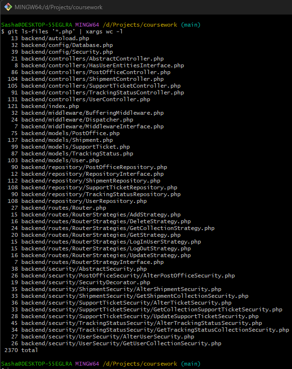

## 🎥 Demonstration

---

### 🔐 **Authentication**

- **Login**  
  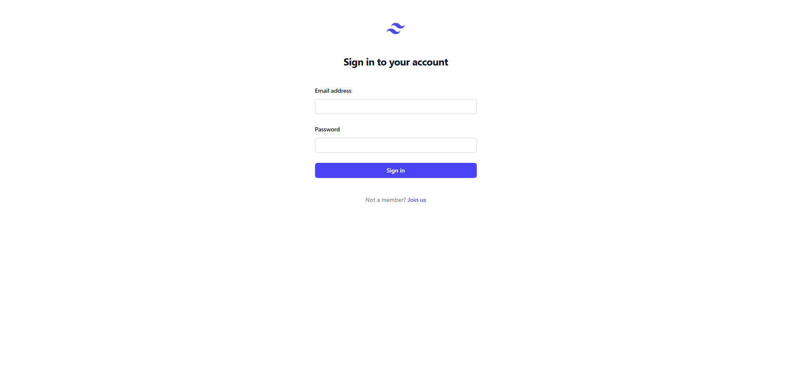

- **Registration**  
  

---

### 👤 **User Dashboard**

- **Profile**  
  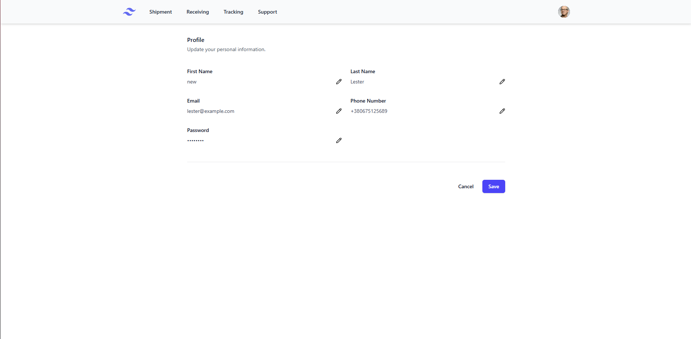

- **Shipments**  
  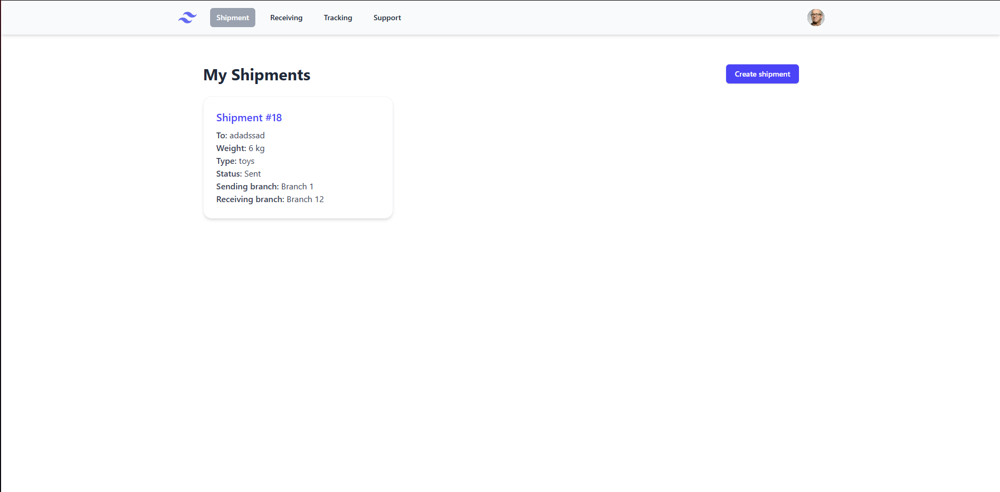

- **Receiving**  
  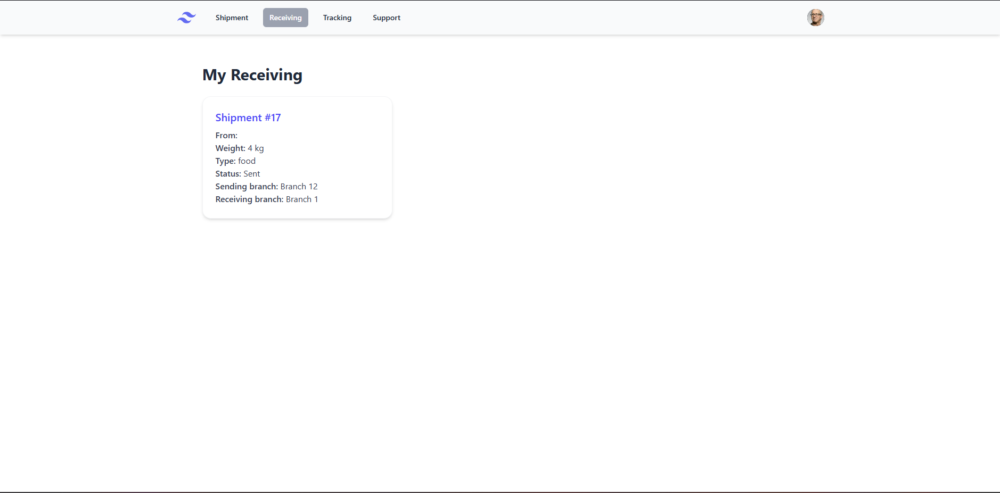

- **Tracking**  
  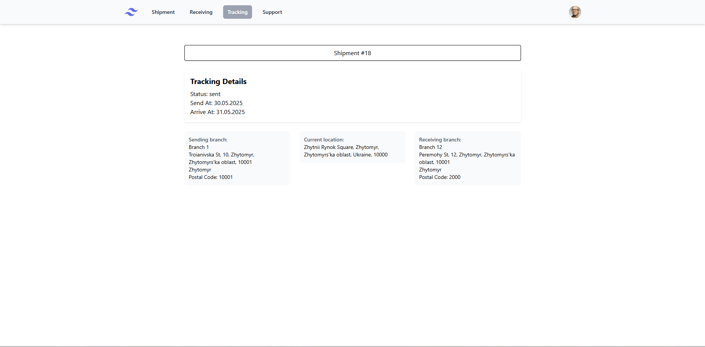

- **Support**  
  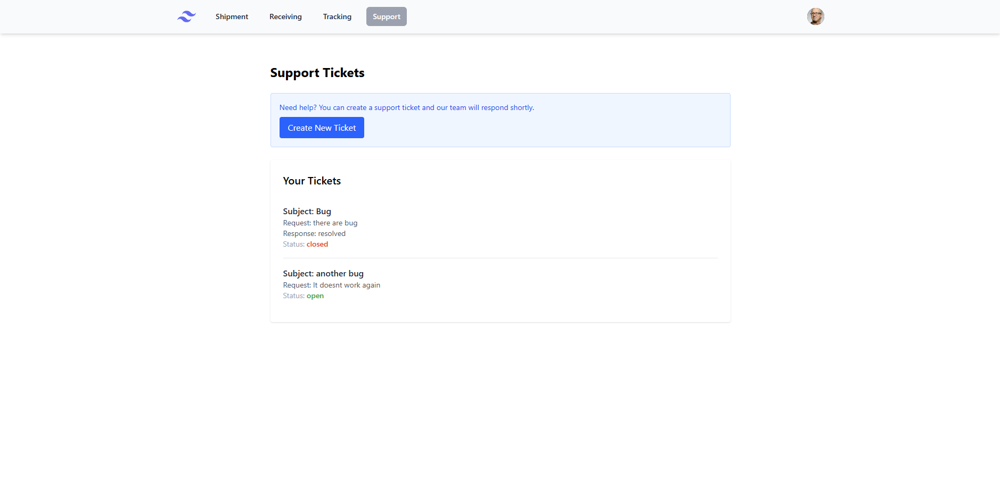

---

### 🛠️ **Administrator Panel**

- **Tracking Management**  
  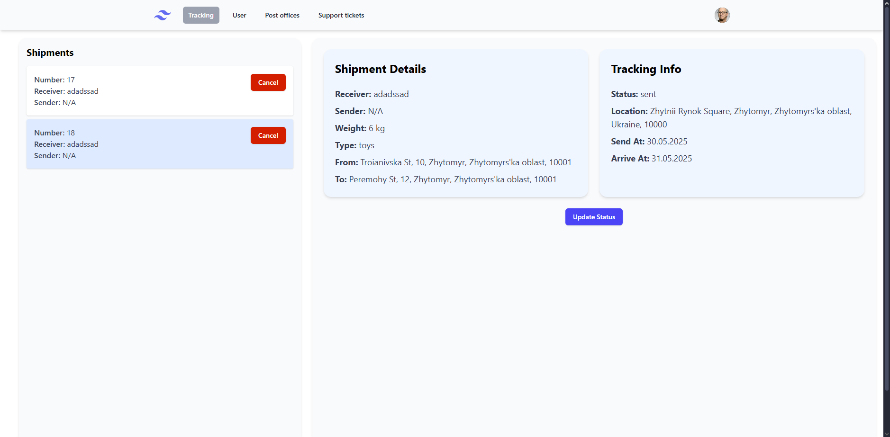

- **User Management**  
  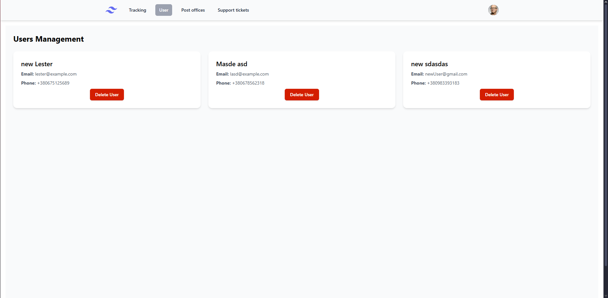

- **Post Offices**  
  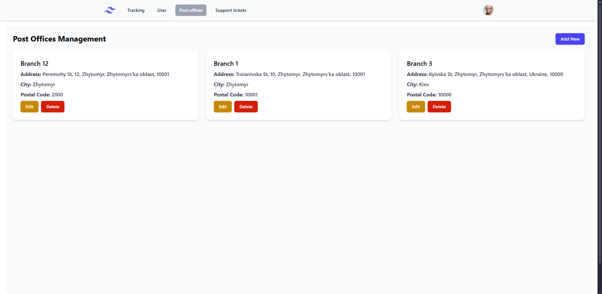

- **Support Tickets**  
  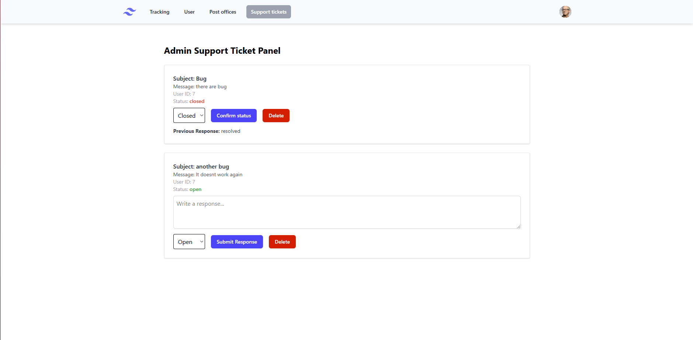

